<!-- Purpose: Document implemented capabilities, architecture and operation diagrams, validation evidence, and known limitations for reviewers. -->

# Implementation status

Capability and evidence inventory; see the [README](../README.md) for the product
and the linked guides for contracts. Automated tests are not live deployment or
production performance evidence.

For a visual review, start with the [architecture diagrams](#architecture-diagrams)
and [operation sequence diagrams](#operation-sequence-diagrams). These are
maintained views of implemented behavior, not proposed features. Keep them even
where they overlap prose; update affected diagrams and the operation index with
every implementation change. Detailed contracts remain in the linked guides.

## Implemented

| Capability | Contract / operations | Test evidence |
| --- | --- | --- |
| Auth0 RS256 identity, device isolation and fleet permission | [API identity](API.md#identity-and-permissions) | [`test_auth.py`](../tests/test_auth.py), [`test_devices.py`](../tests/test_devices.py) |
| Durable raw uploads, retry IDs, async parsing, silver transport, throttled loading, DLQs and cleanup | [Pipeline](INGESTION.md), [recovery](RUNBOOK.md#retry-backpressure-and-recovery) | [`test_uploads.py`](../tests/test_uploads.py) |
| Named registration/inventory, versioned policy and agent acknowledgement | [Device API](API.md#register-a-device-and-configure-its-policy) | [`test_devices.py`](../tests/test_devices.py) |
| JWE suites, wrapped EC key sets, rotation and fail-closed field protection | [Encryption](ENCRYPTION.md) | [`test_encrypted_batches.py`](../tests/test_encrypted_batches.py), [`test_encryption_keys.py`](../tests/test_encryption_keys.py), [`test_openbao.py`](../tests/test_openbao.py) |
| Workspace discard/encryption and ordinary/suspicious partial TTL | [Workspace API](API.md#workspace-configuration), [retention](RUNBOOK.md#retention-operations) | [`test_workspace.py`](../tests/test_workspace.py), [`test_mongo_integration.py`](../tests/test_mongo_integration.py) |
| Strict-secondary analysis and timestamp/ID cursors | [Analysis API](API.md#analyze-logs), [data model](../PROJECT-BLUEPRINT.md#stored-document-layout) | [`test_analysis.py`](../tests/test_analysis.py), [`test_mongo_integration.py`](../tests/test_mongo_integration.py) |
| SSR dashboard/forms, traffic details, devices, workspace and portable Status diagram | [Frontend](../frontend/README.md), [probe semantics](RUNBOOK.md#pipeline-status) | [`frontend/tests/`](../frontend/tests/), [`test_status.py`](../tests/test_status.py) |
| Local Compose dependencies with host API/workers; optional hardened Helm workloads | [Runbook](RUNBOOK.md#local-setup) | [`tests/`](../tests/), [browser validation](../frontend/README.md#validation) |
| Direct Cloud Run URLs, scoped IAM, KMS adapter, missing-only secret bootstrap and rerunnable deployment CLI | [GCP guide](../infra/gcp/README.md), [automated deployment](../infra/gcp/README.md#automated-deployment) | [`infra/gcp/tests/`](../infra/gcp/tests/), [`deploy_checks.py`](../infra/gcp/tests/deploy_checks.py) |

## Architecture diagrams

### High-level components

Arrows show calls or data movement, not a single synchronous transaction.
The device interceptor is external to this repository.

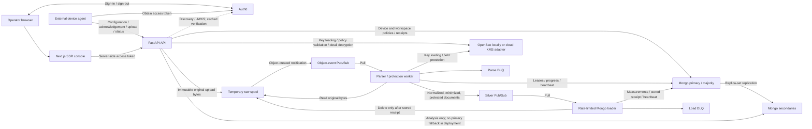
```mermaid
flowchart LR
    Browser["Operator browser"] --> Console["Next.js SSR console"]
    Browser <-->|"Sign-in / sign-out"| Auth0["Auth0"]
    Agent["External device agent"] -->|"Obtain access token"| Auth0
    Agent -->|"Configuration / acknowledgement / upload / status"| API["FastAPI API"]
    Console -->|"Server-side access token"| API
    API -.->|"Discovery / JWKS; cached verification"| Auth0
    API -->|"Device and workspace policies / receipts"| Primary["Mongo primary / majority"]
    API -->|"Immutable original upload bytes"| Raw["Temporary raw spool"]
    Raw -->|"Object-created notification"| Events["Object-event Pub/Sub"]
    Events -->|"Pull"| Parser["Parser / protection worker"]
    Parser -->|"Read original bytes"| Raw
    Parser -->|"Leases / progress / heartbeat"| Primary
    Parser -->|"Normalized, minimized, protected documents"| Silver["Silver Pub/Sub"]
    Silver -->|"Pull"| Loader["Rate-limited Mongo loader"]
    Loader -->|"Measurements / stored receipt / heartbeat"| Primary
    Loader -->|"Delete only after stored receipt"| Raw
    Primary -->|"Replica-set replication"| Secondary["Mongo secondaries"]
    API -->|"Analysis only; no primary fallback in deployment"| Secondary
    API -->|"Key loading / policy validation / detail decryption"| KMS["OpenBao locally or cloud KMS adapter"]
    Parser -->|"Key loading / field protection"| KMS
    Parser --> ParseDLQ["Parse DLQ"]
    Loader --> LoadDLQ["Load DLQ"]
```

`202` acknowledges durable raw receipt, not validated/queryable logs. Original
raw may contain values later discarded by policy. The loader has no EC/KMS
credentials; analysis lists do not decrypt fields. See [pipeline guarantees](INGESTION.md)
and [trust boundaries](../PROJECT-BLUEPRINT.md#trust-and-availability-decisions).

### Development architecture

Default ports are shown; setup/bootstrap tools and the cleaner are not
long-running workloads. `make local-containers-up` selects the full Compose stack:

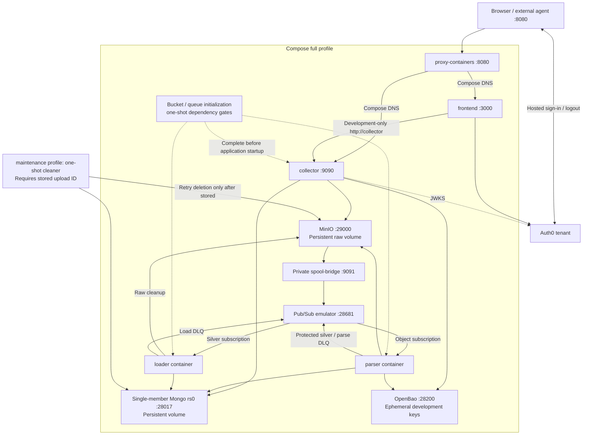
```mermaid
flowchart TB
    Browser["Browser / external agent :8080"] --> Proxy
    Browser <-->|"Hosted sign-in / logout"| Auth0["Auth0 tenant"]
    subgraph Compose["Compose full profile"]
        Proxy["proxy-containers :8080"]
        Frontend["frontend :3000"]
        API["collector :9090"]
        Parser["parser container"]
        Loader["loader container"]
        Mongo["Single-member Mongo rs0 :28017<br/>Persistent volume"]
        Bao["OpenBao :28200<br/>Ephemeral development keys"]
        Minio["MinIO :29000<br/>Persistent raw volume"]
        Bridge["Private spool-bridge :9091"]
        Emulator["Pub/Sub emulator :28681"]
        Initializers["Bucket / queue initialization<br/>one-shot dependency gates"]
    end
    Proxy -->|"Compose DNS"| Frontend
    Proxy -->|"Compose DNS"| API
    Frontend -->|"Development-only http://collector"| API
    Frontend --> Auth0
    API -.->|"JWKS"| Auth0
    API --> Mongo
    API --> Bao
    API --> Minio
    Minio --> Bridge --> Emulator
    Emulator -->|"Object subscription"| Parser
    Parser --> Bao
    Parser --> Minio
    Parser --> Mongo
    Parser -->|"Protected silver / parse DLQ"| Emulator
    Emulator -->|"Silver subscription"| Loader
    Loader --> Mongo
    Loader -->|"Raw cleanup"| Minio
    Loader -->|"Load DLQ"| Emulator
    Initializers -.->|"Complete before application startup"| API
    Initializers -.-> Parser
    Initializers -.-> Loader
    Cleaner["maintenance profile: one-shot cleaner<br/>Requires stored upload ID"] --> Mongo
    Cleaner -->|"Retry deletion only after stored"| Minio
```

Application containers use Compose DNS. The single-node development Mongo URI
permits direct connection only with explicit development-primary reads; production
replica discovery/secondary routing is unchanged. The cleaner is not selected by
`full`; ordinary raw deletion remains in the loader and retention remains Mongo TTL.
Container frontend/API retain the same public localhost origin and Auth0 callbacks.

Native mode remains supported: `make local-native-run` starts dependencies plus
host collector/parser/loader; the frontend starts with `make local-frontend-dev`.
`local-collector-run` alone starts only the host collector. The mixed mode uses
`local-workers-up` with a native collector/frontend.

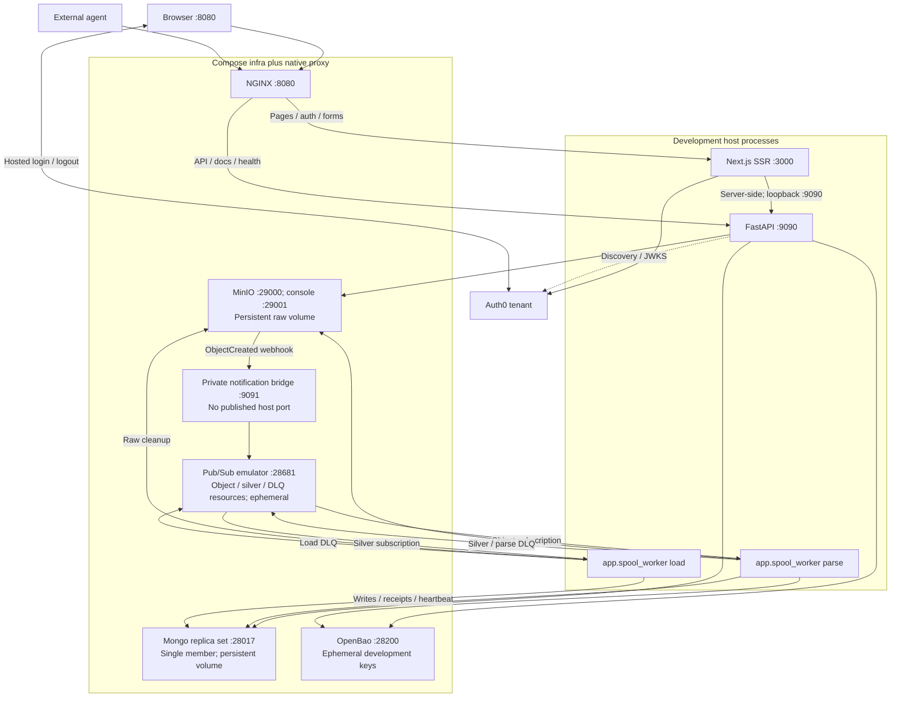
```mermaid
flowchart TB
    Browser["Browser :8080"] --> Proxy
    Agent["External agent"] --> Proxy
    Browser <-->|"Hosted login / logout"| Auth0["Auth0 tenant"]
    subgraph Compose["Compose infra plus native proxy"]
        Proxy["NGINX :8080"]
        Mongo["Mongo replica set :28017<br/>Single member; persistent volume"]
        Bao["OpenBao :28200<br/>Ephemeral development keys"]
        Minio["MinIO :29000; console :29001<br/>Persistent raw volume"]
        Bridge["Private notification bridge :9091<br/>No published host port"]
        Emulator["Pub/Sub emulator :28681<br/>Object / silver / DLQ resources; ephemeral"]
    end
    subgraph Host["Development host processes"]
        Frontend["Next.js SSR :3000"]
        API["FastAPI :9090"]
        Parser["app.spool_worker parse"]
        Loader["app.spool_worker load"]
    end
    Proxy -->|"Pages / auth / forms"| Frontend
    Proxy -->|"API / docs / health"| API
    Frontend -->|"Server-side; loopback :9090"| API
    Frontend --> Auth0
    API -.->|"Discovery / JWKS"| Auth0
    API --> Mongo
    API --> Bao
    API --> Minio
    Minio -->|"ObjectCreated webhook"| Bridge
    Bridge --> Emulator
    Emulator -->|"Object subscription"| Parser
    Parser --> Minio
    Parser --> Bao
    Parser --> Mongo
    Parser -->|"Silver / parse DLQ"| Emulator
    Emulator -->|"Silver subscription"| Loader
    Loader -->|"Writes / receipts / heartbeat"| Mongo
    Loader -->|"Raw cleanup"| Minio
    Loader -->|"Load DLQ"| Emulator
```

Local analysis explicitly permits primary reads for the single-member replica
set; this is not production fallback. Native Linux uses `proxy-host` host
networking instead of Docker Desktop's host gateway. Mongo/MinIO volumes persist,
but restarting OpenBao loses encryption keys and restarting the emulator loses
queue state. See [local setup](RUNBOOK.md#local-setup) and
[replay](RUNBOOK.md#retry-backpressure-and-recovery).

### Production architecture

This is the implemented **GCP Terraform deployment topology**, not evidence of a
validated live production deployment. Frontend and API have separate generated
Cloud Run HTTPS origins; neither a load balancer nor a custom domain is required.

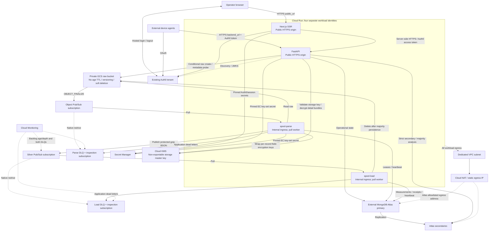
```mermaid
flowchart TB
    Browser["Operator browser"] -->|"HTTPS public_url"| Frontend
    Browser <-->|"Hosted login / logout"| Auth0["Existing Auth0 tenant"]
    Agent["External device agents"] -->|"HTTPS backend_url + Auth0 token"| API
    Agent -->|"OAuth"| Auth0
    subgraph Run["Cloud Run; four separate workload identities"]
        Frontend["Next.js SSR<br/>Public HTTPS origin"]
        API["FastAPI<br/>Public HTTPS origin"]
        Parser["spool-parse<br/>Internal ingress; pull worker"]
        Loader["spool-load<br/>Internal ingress; pull worker"]
    end
    Frontend -->|"Server-side HTTPS / Auth0 access token"| API
    Frontend --> Auth0
    API -.->|"Discovery / JWKS"| Auth0
    API -->|"Conditional raw create / metadata probe"| GCS["Private GCS raw bucket<br/>No age TTL / versioning / soft deletion"]
    GCS -->|"OBJECT_FINALIZE"| Events["Object Pub/Sub subscription"]
    Events -->|"Pull"| Parser
    Parser -->|"Read raw"| GCS
    Parser -->|"Publish protected gzip BSON"| Silver["Silver Pub/Sub subscription"]
    Silver -->|"Pull"| Loader
    Loader -->|"Delete after majority persistence"| GCS
    Events -.->|"Native redrive"| ParseDLQ["Parse DLQ + inspection subscription"]
    Parser -->|"Application dead letters"| ParseDLQ
    Silver -.->|"Native redrive"| LoadDLQ["Load DLQ + inspection subscription"]
    Loader -->|"Application dead letters"| LoadDLQ
    API -->|"Operational state"| Primary["External MongoDB Atlas primary"]
    Parser -->|"Leases / heartbeat"| Primary
    Loader -->|"Measurements / receipts / heartbeat"| Primary
    Primary -->|"Replication"| Secondary["Atlas secondaries"]
    API -->|"Strict secondary / majority analysis"| Secondary
    Frontend -->|"Pinned Auth0/session secrets"| Secrets["Secret Manager"]
    API -->|"Pinned EC key-set secret"| Secrets
    Parser -->|"Pinned EC key-set secret"| Secrets
    API -->|"Validate storage key / decrypt detail bundles"| KMS["Cloud KMS<br/>Non-exportable storage master key"]
    Parser -->|"Wrap per-record field-encryption keys"| KMS
    Run -.->|"All workload egress"| VPC["Dedicated VPC subnet"]
    VPC --> NAT["Cloud NAT / static egress IP"]
    NAT -.->|"Atlas allowlisted egress address"| Primary
    NAT -.-> Secondary
    Monitor["Cloud Monitoring"] -.->|"Backlog age/depth and both DLQs"| Silver
    Monitor -.-> ParseDLQ
    Monitor -.-> LoadDLQ
```

Service arrows above are logical calls; all Cloud Run egress traverses the VPC/NAT
path. Atlas is provisioned independently. Runtime access uses scoped workload
identity/ADC, not service-account key files. The loader has neither EC key-set nor
KMS access. Cloud ciphertext is not interchangeable with local OpenBao ciphertext.
See [GCP architecture and IAM](../infra/gcp/README.md#architecture).
The runtime topology is unchanged by the
[automated deployment operation](#automated-gcp-deployment), which provisions and
reconciles these resources from the operator's machine.

The [optional Helm deployment](RUNBOOK.md#optional-local-kubernetes-deployment)
runs the same API/parser/loader and optional frontend in Kubernetes, with
externally provisioned GCS/Pub/Sub/IAM, an external TLS ingress, and production
Mongo/OpenBao. It is an alternative to Cloud Run, not an extra production hop.

## Operation sequence diagrams

### Operation index

All implemented application HTTP operations are mapped below, along with worker,
recovery and key-management flows. `/docs`, `/redoc` and `/openapi.json` are
framework-generated documentation, not separate business operations.
Paths use `/api/v1` unless shown otherwise. Grouped diagrams label the distinct
requests and outcomes; common token validation is shown once.

| Implemented operation | Sequence |
| --- | --- |
| Console sign-in, refresh, sign-out; API authentication; `GET /me` | [Identity and sessions](#identity-and-sessions) |
| SSR `/overview`, `/logs`, `/logs/:id`, `/devices`, `/devices/:id`, `/settings`, `/status`; registration and policy forms | [Console reads and forms](#console-reads-and-forms) and the corresponding API flows below |
| `POST /devices` | [Device registration](#device-registration) |
| `GET /devices`, `GET /devices/{id}`, `GET /devices/{id}/configuration` | [Inventory and configuration reads](#inventory-and-configuration-reads) |
| `PATCH /devices/{id}/configuration`, `PUT /devices/{id}/configuration-status` | [Policy changes and agent acknowledgement](#policy-changes-and-agent-acknowledgement) |
| `GET /workspace/configuration`, `PATCH /workspace/configuration`; TTL reconciliation/expiration | [Workspace storage and retention](#workspace-storage-and-retention) |
| `POST /traffic-log-uploads` including identical/conflicting retries | [Durable upload acceptance](#durable-upload-acceptance) |
| `app.spool_worker parse` | [Parsing and protection](#parsing-and-protection) |
| `app.spool_worker load` | [Mongo loading and raw cleanup](#mongo-loading-and-raw-cleanup) |
| `GET /traffic-log-uploads/{upload_id}` | [Upload status polling](#upload-status-polling) |
| `GET /traffic-logs`, `GET /traffic-logs/{id}` | [Traffic search and details](#traffic-search-and-details) |
| `GET /status`, worker heartbeats | [Pipeline health](#pipeline-health) |
| Public `GET /health` | [Process liveness](#process-liveness) |
| `app.spool_worker replay`, `app.spool_worker cleanup` | [Operator recovery](#operator-recovery) |
| OpenBao bootstrap, runtime key loading, EC/KEK/storage rotation | [Local and Helm key management](#local-and-helm-key-management) |
| GCP missing-only secret/key bootstrap and runtime loading | [Cloud secret and key bootstrap](#cloud-secret-and-key-bootstrap) |
| `make gcp-check`, `make gcp-deploy` | [Automated GCP deployment](#automated-gcp-deployment) |
| `integration_tests.benchmark_ingestion` | [Ingestion latency measurement](#ingestion-latency-measurement) |
| `local-containers-up`, native component commands, profile selection and `local-cleanup` | [Local development startup and maintenance](#local-development-startup-and-maintenance) |

### Identity and sessions

Sources: [`auth.py`](../app/core/auth.py), [`/me`](../app/api/auth.py),
[`frontend/proxy.js`](../frontend/proxy.js), [session contract](../frontend/README.md#management-permissions).
Agents obtain tokens directly from Auth0; this backend has no token-issuance API.

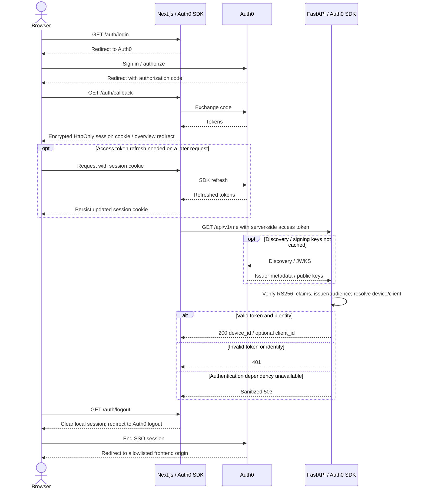
```mermaid
sequenceDiagram
    actor Browser
    participant SSR as Next.js / Auth0 SDK
    participant IdP as Auth0
    participant API as FastAPI / Auth0 SDK
    Browser->>SSR: GET /auth/login
    SSR-->>Browser: Redirect to Auth0
    Browser->>IdP: Sign in / authorize
    IdP-->>Browser: Redirect with authorization code
    Browser->>SSR: GET /auth/callback
    SSR->>IdP: Exchange code
    IdP-->>SSR: Tokens
    SSR-->>Browser: Encrypted HttpOnly session cookie / overview redirect
    opt Access token refresh needed on a later request
        Browser->>SSR: Request with session cookie
        SSR->>IdP: SDK refresh
        IdP-->>SSR: Refreshed tokens
        SSR-->>Browser: Persist updated session cookie
    end
    SSR->>API: GET /api/v1/me with server-side access token
    opt Discovery / signing keys not cached
        API->>IdP: Discovery / JWKS
        IdP-->>API: Issuer metadata / public keys
    end
    API->>API: Verify RS256, claims, issuer/audience#59; resolve device/client
    alt Valid token and identity
        API-->>SSR: 200 device_id / optional client_id
    else Invalid token or identity
        API-->>SSR: 401
    else Authentication dependency unavailable
        API-->>SSR: Sanitized 503
    end
    Browser->>SSR: GET /auth/logout
    SSR-->>Browser: Clear local session#59; redirect to Auth0 logout
    Browser->>IdP: End SSO session
    IdP-->>Browser: Redirect to allowlisted frontend origin
```

Tokens stay server-side; `/auth/access-token` is disabled. The same API
verification applies to every versioned operation below. Deployment HTTP
`/api/v1/*` requests are refused before normal handling unless trusted ingress
has established HTTPS.

### Console reads and forms

Sources: [`frontend/app/`](../frontend/app/), [`API adapter`](../frontend/lib/api.js).
This shared sequence covers all dashboard screens and authenticated Server Actions.
Overview statistics are calculated from a latest-50-record sample, not aggregation.

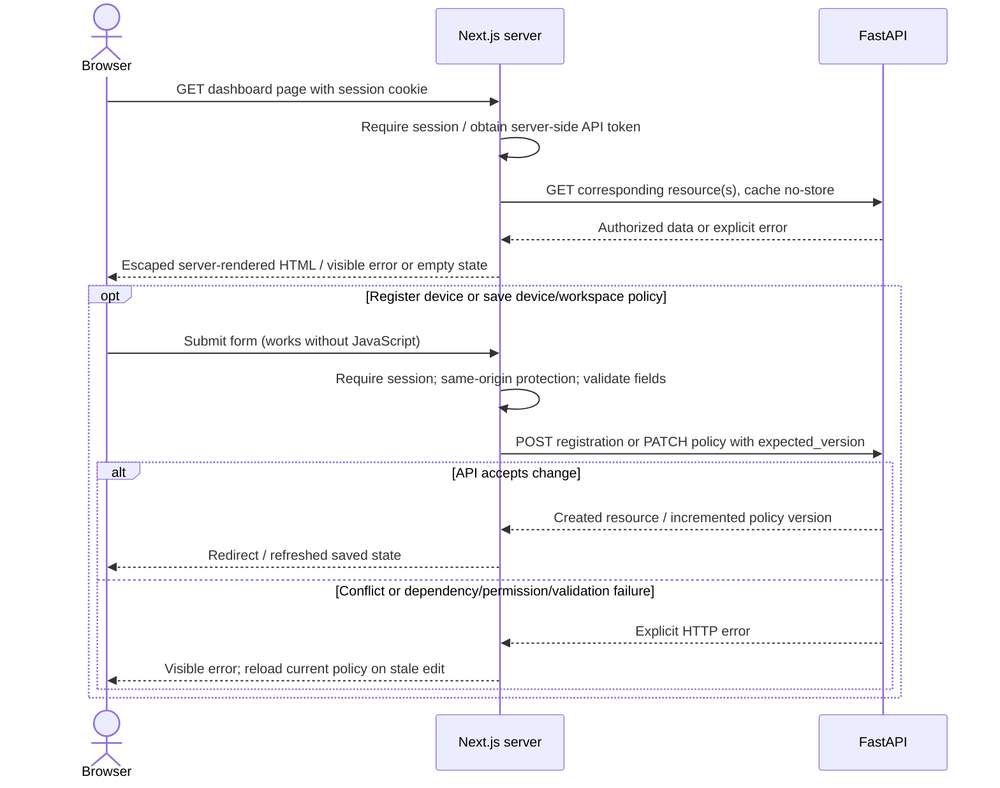
```mermaid
sequenceDiagram
    actor Browser
    participant SSR as Next.js server
    participant API as FastAPI
    Browser->>SSR: GET dashboard page with session cookie
    SSR->>SSR: Require session / obtain server-side API token
    SSR->>API: GET corresponding resource(s), cache no-store
    API-->>SSR: Authorized data or explicit error
    SSR-->>Browser: Escaped server-rendered HTML / visible error or empty state
    opt Register device or save device/workspace policy
        Browser->>SSR: Submit form (works without JavaScript)
        SSR->>SSR: Require session#59; same-origin protection#59; validate fields
        SSR->>API: POST registration or PATCH policy with expected_version
        alt API accepts change
            API-->>SSR: Created resource / incremented policy version
            SSR-->>Browser: Redirect / refreshed saved state
        else Conflict or dependency/permission/validation failure
            API-->>SSR: Explicit HTTP error
            SSR-->>Browser: Visible error#59; reload current policy on stale edit
        end
    end
```

### Device registration

Source: [`devices.py`](../app/api/devices.py);
[registration contract](API.md#register-a-device-and-configure-its-policy).

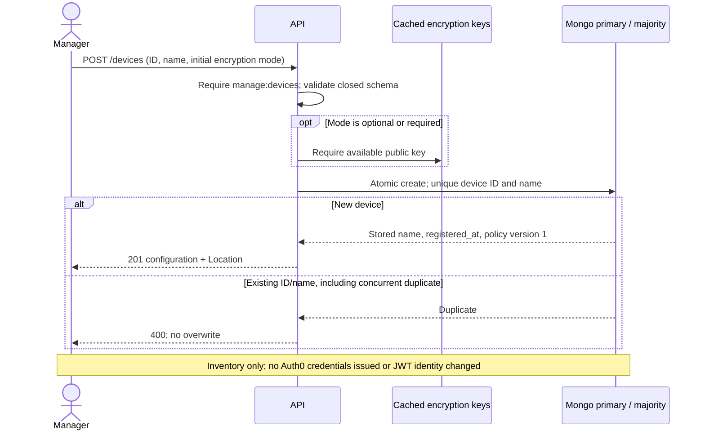
```mermaid
sequenceDiagram
    actor Manager
    participant API
    participant Keys as Cached encryption keys
    participant Mongo as Mongo primary / majority
    Manager->>API: POST /devices (ID, name, initial encryption mode)
    API->>API: Require manage:devices#59; validate closed schema
    opt Mode is optional or required
        API->>Keys: Require available public key
    end
    API->>Mongo: Atomic create#59; unique device ID and name
    alt New device
        Mongo-->>API: Stored name, registered_at, policy version 1
        API-->>Manager: 201 configuration + Location
    else Existing ID/name, including concurrent duplicate
        Mongo-->>API: Duplicate
        API-->>Manager: 400#59; no overwrite
    end
    Note over Manager,Mongo: Inventory only#59; no Auth0 credentials issued or JWT identity changed
```

### Inventory and configuration reads

Source: [`devices.py`](../app/api/devices.py). All reads use operational Mongo,
not the analysis secondary.

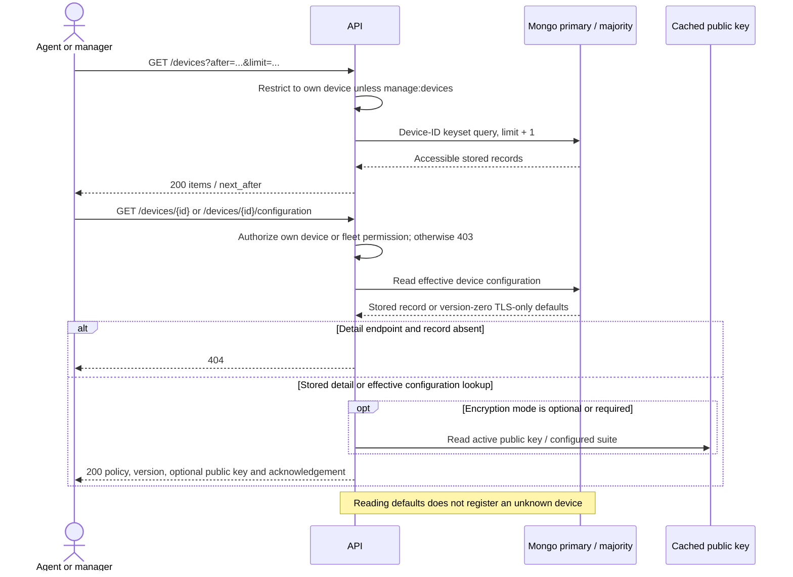
```mermaid
sequenceDiagram
    actor Caller as Agent or manager
    participant API
    participant Mongo as Mongo primary / majority
    participant Keys as Cached public key
    Caller->>API: GET /devices?after=...&limit=...
    API->>API: Restrict to own device unless manage:devices
    API->>Mongo: Device-ID keyset query, limit + 1
    Mongo-->>API: Accessible stored records
    API-->>Caller: 200 items / next_after
    Caller->>API: GET /devices/{id} or /devices/{id}/configuration
    API->>API: Authorize own device or fleet permission#59; otherwise 403
    API->>Mongo: Read effective device configuration
    Mongo-->>API: Stored record or version-zero TLS-only defaults
    alt Detail endpoint and record absent
        API-->>Caller: 404
    else Stored detail or effective configuration lookup
        opt Encryption mode is optional or required
            API->>Keys: Read active public key / configured suite
        end
        API-->>Caller: 200 policy, version, optional public key and acknowledgement
    end
    Note over API,Mongo: Reading defaults does not register an unknown device
```

### Policy changes and agent acknowledgement

Source: [`devices.py`](../app/api/devices.py);
[management protocol](ENCRYPTION.md#management-protocol).

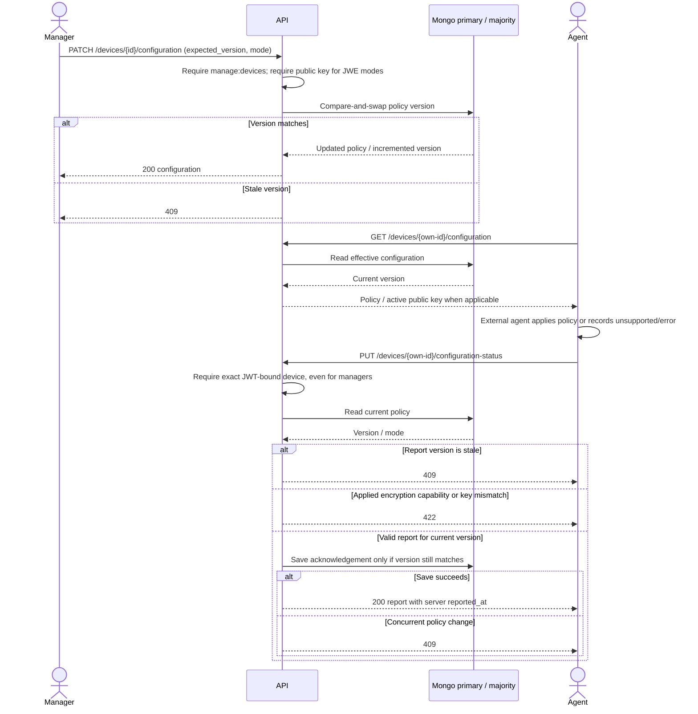
```mermaid
sequenceDiagram
    actor Manager
    participant API
    participant Mongo as Mongo primary / majority
    actor Agent
    Manager->>API: PATCH /devices/{id}/configuration (expected_version, mode)
    API->>API: Require manage:devices#59; require public key for JWE modes
    API->>Mongo: Compare-and-swap policy version
    alt Version matches
        Mongo-->>API: Updated policy / incremented version
        API-->>Manager: 200 configuration
    else Stale version
        API-->>Manager: 409
    end
    Agent->>API: GET /devices/{own-id}/configuration
    API->>Mongo: Read effective configuration
    Mongo-->>API: Current version
    API-->>Agent: Policy / active public key when applicable
    Agent->>Agent: External agent applies policy or records unsupported/error
    Agent->>API: PUT /devices/{own-id}/configuration-status
    API->>API: Require exact JWT-bound device, even for managers
    API->>Mongo: Read current policy
    Mongo-->>API: Version / mode
    alt Report version is stale
        API-->>Agent: 409
    else Applied encryption capability or key mismatch
        API-->>Agent: 422
    else Valid report for current version
        API->>Mongo: Save acknowledgement only if version still matches
        alt Save succeeds
            API-->>Agent: 200 report with server reported_at
        else Concurrent policy change
            API-->>Agent: 409
        end
    end
```

### Workspace storage and retention

Sources: [`workspace.py`](../app/api/workspace.py),
[`Mongo reconciliation`](../app/db/mongo.py);
[retention operations](RUNBOOK.md#retention-operations).

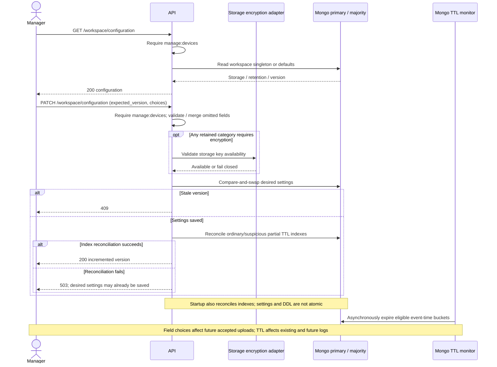
```mermaid
sequenceDiagram
    actor Manager
    participant API
    participant KMS as Storage encryption adapter
    participant Mongo as Mongo primary / majority
    participant TTL as Mongo TTL monitor
    Manager->>API: GET /workspace/configuration
    API->>API: Require manage:devices
    API->>Mongo: Read workspace singleton or defaults
    Mongo-->>API: Storage / retention / version
    API-->>Manager: 200 configuration
    Manager->>API: PATCH /workspace/configuration (expected_version, choices)
    API->>API: Require manage:devices#59; validate / merge omitted fields
    opt Any retained category requires encryption
        API->>KMS: Validate storage key availability
        KMS-->>API: Available or fail closed
    end
    API->>Mongo: Compare-and-swap desired settings
    alt Stale version
        API-->>Manager: 409
    else Settings saved
        API->>Mongo: Reconcile ordinary/suspicious partial TTL indexes
        alt Index reconciliation succeeds
            API-->>Manager: 200 incremented version
        else Reconciliation fails
            API-->>Manager: 503#59; desired settings may already be saved
        end
    end
    Note over API,Mongo: Startup also reconciles indexes#59; settings and DDL are not atomic
    TTL->>Mongo: Asynchronously expire eligible event-time buckets
    Note over Manager,TTL: Field choices affect future accepted uploads#59; TTL affects existing and future logs
```

### Durable upload acceptance

Source: [`uploads.py`](../app/api/uploads.py);
[receipt/retry guarantees](INGESTION.md#object-format-and-retry-protection).

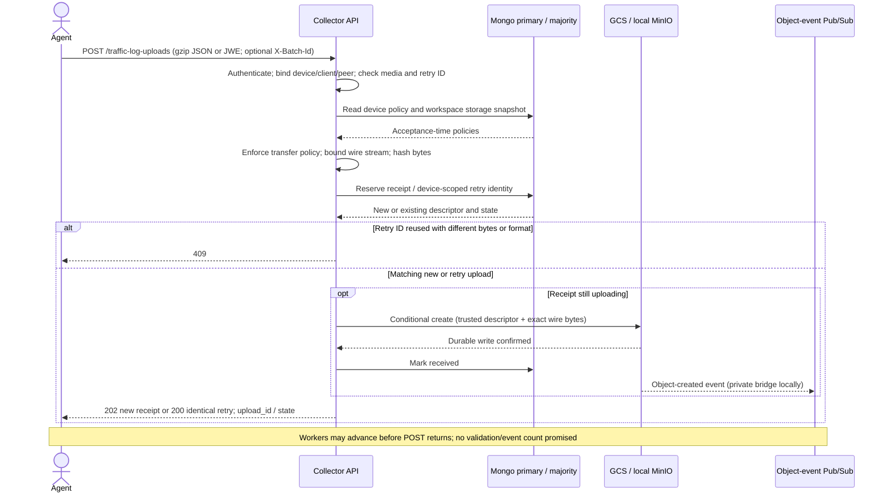
```mermaid
sequenceDiagram
    actor Agent
    participant API as Collector API
    participant Mongo as Mongo primary / majority
    participant Raw as GCS / local MinIO
    participant Events as Object-event Pub/Sub
    Agent->>API: POST /traffic-log-uploads (gzip JSON or JWE#59; optional X-Batch-Id)
    API->>API: Authenticate#59; bind device/client/peer#59; check media and retry ID
    API->>Mongo: Read device policy and workspace storage snapshot
    Mongo-->>API: Acceptance-time policies
    API->>API: Enforce transfer policy#59; bound wire stream#59; hash bytes
    API->>Mongo: Reserve receipt / device-scoped retry identity
    Mongo-->>API: New or existing descriptor and state
    alt Retry ID reused with different bytes or format
        API-->>Agent: 409
    else Matching new or retry upload
        opt Receipt still uploading
            API->>Raw: Conditional create (trusted descriptor + exact wire bytes)
            Raw-->>API: Durable write confirmed
            API->>Mongo: Mark received
            Raw-->>Events: Object-created event (private bridge locally)
        end
        API-->>Agent: 202 new receipt or 200 identical retry#59; upload_id / state
    end
    Note over Agent,Events: Workers may advance before POST returns#59; no validation/event count promised
```

Bad media, wire size and transfer policy fail synchronously; content, JWE and
expanded-size validation belong to the parser. Dependency failures return
sanitized `503`, never an acknowledgement of nondurable raw.

### Parsing and protection

Source: [`UploadParser`](../app/services/upload_pipeline.py);
[policy boundary](INGESTION.md#acknowledgement-and-policy-boundaries).

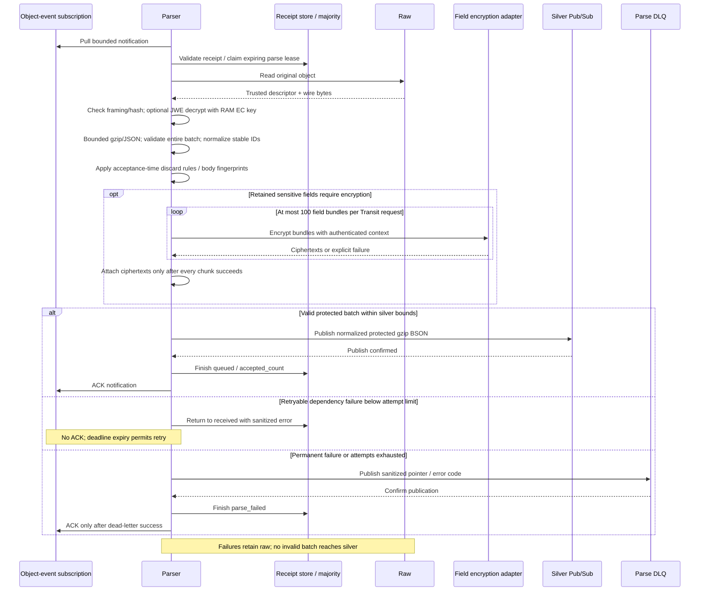
```mermaid
sequenceDiagram
    participant Events as Object-event subscription
    participant Parser
    participant Mongo as Receipt store / majority
    participant Raw
    participant KMS as Field encryption adapter
    participant Silver as Silver Pub/Sub
    participant DLQ as Parse DLQ
    Parser->>Events: Pull bounded notification
    Parser->>Mongo: Validate receipt / claim expiring parse lease
    Parser->>Raw: Read original object
    Raw-->>Parser: Trusted descriptor + wire bytes
    Parser->>Parser: Check framing/hash#59; optional JWE decrypt with RAM EC key
    Parser->>Parser: Bounded gzip/JSON#59; validate entire batch#59; normalize stable IDs
    Parser->>Parser: Apply acceptance-time discard rules / body fingerprints
    opt Retained sensitive fields require encryption
        loop At most 100 field bundles per Transit request
            Parser->>KMS: Encrypt bundles with authenticated context
            KMS-->>Parser: Ciphertexts or explicit failure
        end
        Parser->>Parser: Attach ciphertexts only after every chunk succeeds
    end
    alt Valid protected batch within silver bounds
        Parser->>Silver: Publish normalized protected gzip BSON
        Silver-->>Parser: Publish confirmed
        Parser->>Mongo: Finish queued / accepted_count
        Parser->>Events: ACK notification
    else Retryable dependency failure below attempt limit
        Parser->>Mongo: Return to received with sanitized error
        Note over Events,Parser: No ACK#59; deadline expiry permits retry
    else Permanent failure or attempts exhausted
        Parser->>DLQ: Publish sanitized pointer / error code
        DLQ-->>Parser: Confirm publication
        Parser->>Mongo: Finish parse_failed
        Parser->>Events: ACK only after dead-letter success
    end
    Note over Parser,Raw: Failures retain raw#59; no invalid batch reaches silver
```

Duplicate notifications skip terminal/already-queued work. A late raw object for
a `stored` receipt publishes cleanup-only work instead of reparsing. Failure to
publish a dead letter leaves the notification unacknowledged.

### Mongo loading and raw cleanup

Source: [`UploadLoader`](../app/services/upload_pipeline.py);
[delivery limits](INGESTION.md#object-format-and-retry-protection).

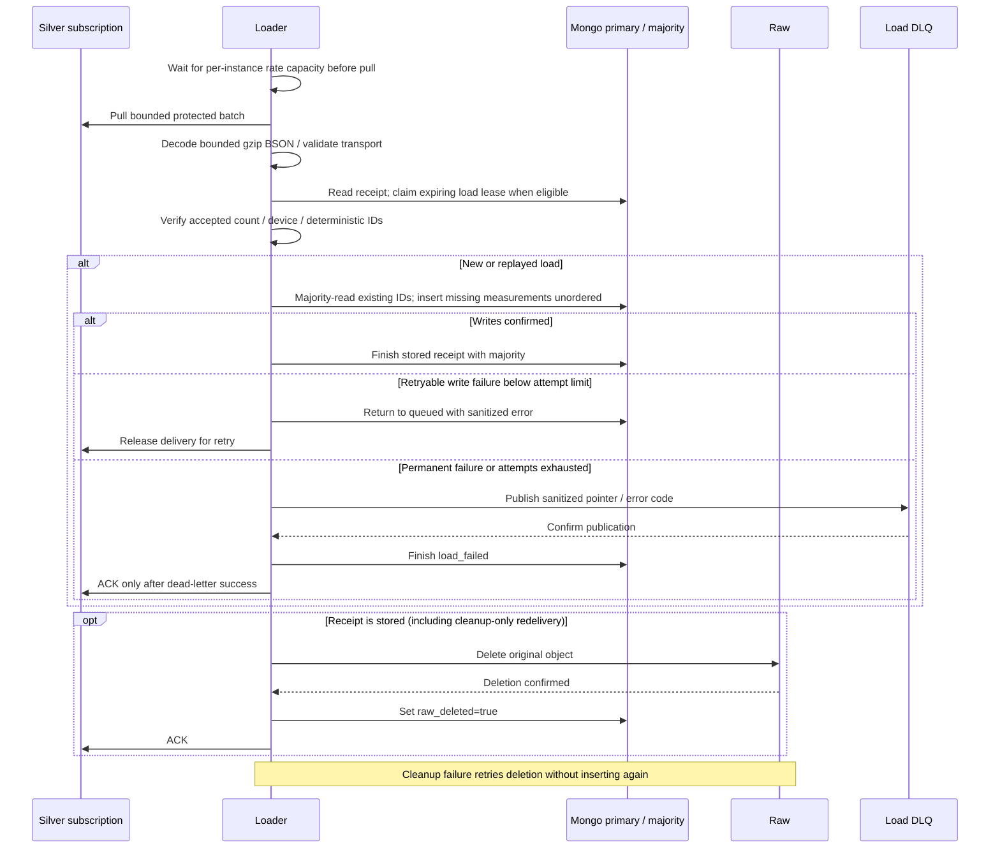
```mermaid
sequenceDiagram
    participant Silver as Silver subscription
    participant Loader
    participant Mongo as Mongo primary / majority
    participant Raw
    participant DLQ as Load DLQ
    Loader->>Loader: Wait for per-instance rate capacity before pull
    Loader->>Silver: Pull bounded protected batch
    Loader->>Loader: Decode bounded gzip BSON / validate transport
    Loader->>Mongo: Read receipt#59; claim expiring load lease when eligible
    Loader->>Loader: Verify accepted count / device / deterministic IDs
    alt New or replayed load
        Loader->>Mongo: Majority-read existing IDs#59; insert missing measurements unordered
        alt Writes confirmed
            Loader->>Mongo: Finish stored receipt with majority
        else Retryable write failure below attempt limit
            Loader->>Mongo: Return to queued with sanitized error
            Loader->>Silver: Release delivery for retry
        else Permanent failure or attempts exhausted
            Loader->>DLQ: Publish sanitized pointer / error code
            DLQ-->>Loader: Confirm publication
            Loader->>Mongo: Finish load_failed
            Loader->>Silver: ACK only after dead-letter success
        end
    end
    opt Receipt is stored (including cleanup-only redelivery)
        Loader->>Raw: Delete original object
        Raw-->>Loader: Deletion confirmed
        Loader->>Mongo: Set raw_deleted=true
        Loader->>Silver: ACK
    end
    Note over Loader,Raw: Cleanup failure retries deletion without inserting again
```

There is no EC/KMS access here. Delivery is at least once: time-series IDs are
not unique-enforced and measurements/receipts are not one transaction, so an
ambiguously acknowledged write can duplicate records. Native Pub/Sub redrive
also targets each stage's DLQ; native load dead letters can carry documents.

### Upload status polling

Source: [`uploads.py`](../app/api/uploads.py). This is an agent/API operation;
there is no upload-management screen.

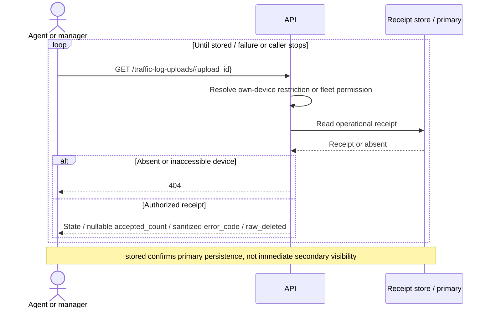
```mermaid
sequenceDiagram
    actor Caller as Agent or manager
    participant API
    participant Mongo as Receipt store / primary
    loop Until stored / failure or caller stops
        Caller->>API: GET /traffic-log-uploads/{upload_id}
        API->>API: Resolve own-device restriction or fleet permission
        API->>Mongo: Read operational receipt
        Mongo-->>API: Receipt or absent
        alt Absent or inaccessible device
            API-->>Caller: 404
        else Authorized receipt
            API-->>Caller: State / nullable accepted_count / sanitized error_code / raw_deleted
        end
    end
    Note over Caller,Mongo: stored confirms primary persistence, not immediate secondary visibility
```

### Traffic search and details

Sources: [`traffic_logs.py`](../app/api/traffic_logs.py),
[`analysis.py`](../app/services/analysis.py); [analysis contract](API.md#analyze-logs).

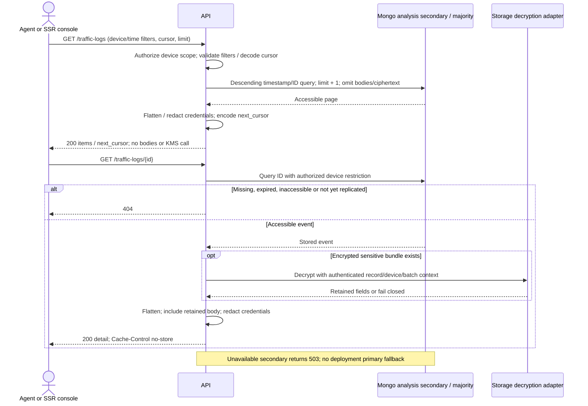
```mermaid
sequenceDiagram
    actor Caller as Agent or SSR console
    participant API
    participant Replica as Mongo analysis secondary / majority
    participant KMS as Storage decryption adapter
    Caller->>API: GET /traffic-logs (device/time filters, cursor, limit)
    API->>API: Authorize device scope#59; validate filters / decode cursor
    API->>Replica: Descending timestamp/ID query#59; limit + 1#59; omit bodies/ciphertext
    Replica-->>API: Accessible page
    API->>API: Flatten / redact credentials#59; encode next_cursor
    API-->>Caller: 200 items / next_cursor#59; no bodies or KMS call
    Caller->>API: GET /traffic-logs/{id}
    API->>Replica: Query ID with authorized device restriction
    alt Missing, expired, inaccessible or not yet replicated
        API-->>Caller: 404
    else Accessible event
        Replica-->>API: Stored event
        opt Encrypted sensitive bundle exists
            API->>KMS: Decrypt with authenticated record/device/batch context
            KMS-->>API: Retained fields or fail closed
        end
        API->>API: Flatten#59; include retained body#59; redact credentials
        API-->>Caller: 200 detail#59; Cache-Control no-store
    end
    Note over API,Replica: Unavailable secondary returns 503#59; no deployment primary fallback
```

### Pipeline health

Sources: [`pipeline_status.py`](../app/services/pipeline_status.py),
[`worker heartbeat`](../app/spool_worker.py); [probe semantics](RUNBOOK.md#pipeline-status).

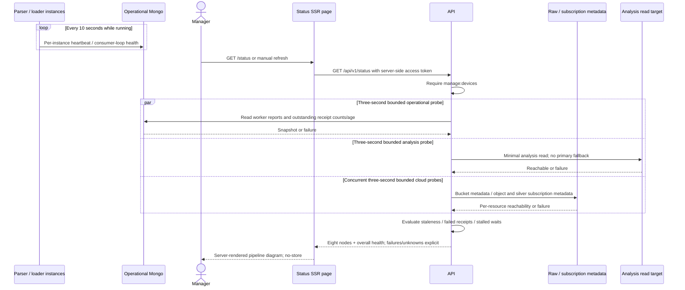
```mermaid
sequenceDiagram
    participant Workers as Parser / loader instances
    participant Mongo as Operational Mongo
    actor Manager
    participant SSR as Status SSR page
    participant API
    participant Cloud as Raw / subscription metadata
    participant Replica as Analysis read target
    loop Every 10 seconds while running
        Workers->>Mongo: Per-instance heartbeat / consumer-loop health
    end
    Manager->>SSR: GET /status or manual refresh
    SSR->>API: GET /api/v1/status with server-side access token
    API->>API: Require manage:devices
    par Three-second bounded operational probe
        API->>Mongo: Read worker reports and outstanding receipt counts/age
        Mongo-->>API: Snapshot or failure
    and Three-second bounded analysis probe
        API->>Replica: Minimal analysis read#59; no primary fallback
        Replica-->>API: Reachable or failure
    and Concurrent three-second bounded cloud probes
        API->>Cloud: Bucket metadata / object and silver subscription metadata
        Cloud-->>API: Per-resource reachability or failure
    end
    API->>API: Evaluate staleness / failed receipts / stalled waits
    API-->>SSR: Eight nodes + overall health#59; failures/unknowns explicit
    SSR-->>Manager: Server-rendered pipeline diagram#59; no-store
```

Probes never pull/ACK messages or write synthetic uploads. Counts come from
receipts, not native queue/DLQ depth; the snapshot is not an end-to-end guarantee.

### Process liveness

Source: [`main.py`](../app/main.py).

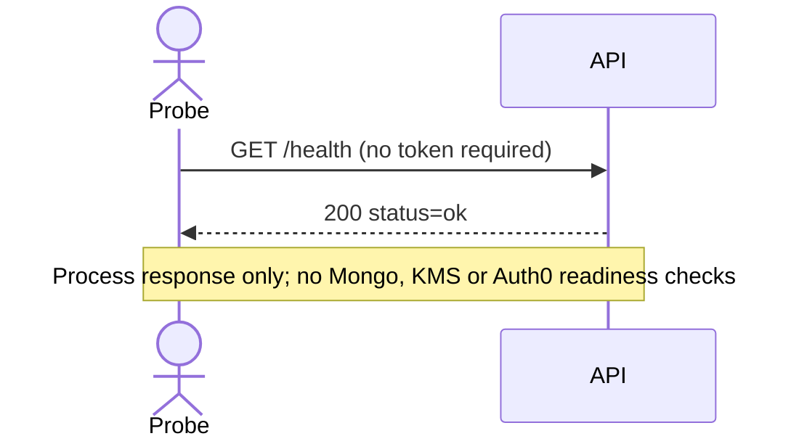
```mermaid
sequenceDiagram
    actor Probe
    participant API
    Probe->>API: GET /health (no token required)
    API-->>Probe: 200 status=ok
    Note over Probe,API: Process response only#59; no Mongo, KMS or Auth0 readiness checks
```

### Operator recovery

Sources: [`spool_worker.py`](../app/spool_worker.py),
[`cleanup`](../app/services/upload_pipeline.py);
[recovery procedure](RUNBOOK.md#retry-backpressure-and-recovery).

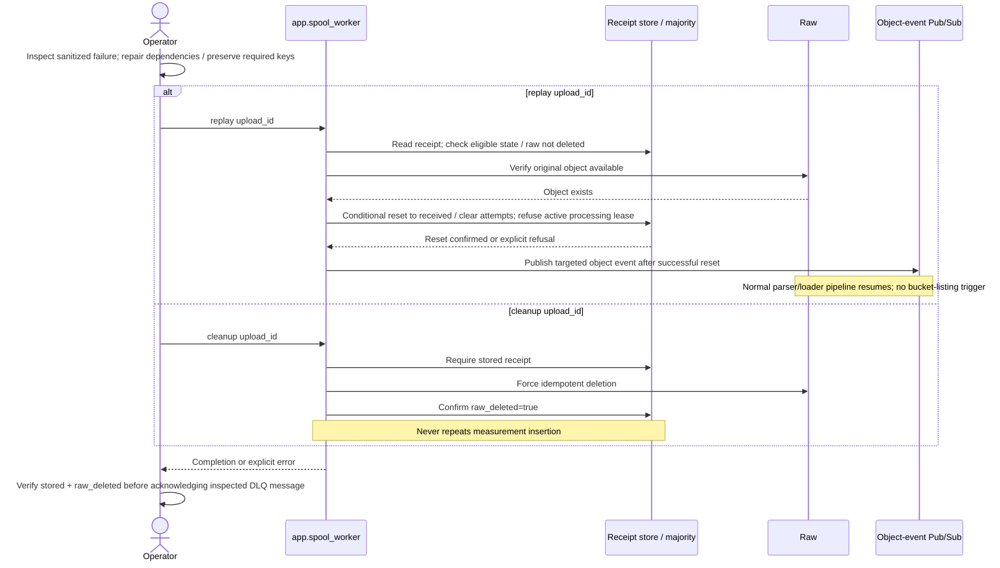
```mermaid
sequenceDiagram
    actor Operator
    participant CLI as app.spool_worker
    participant Mongo as Receipt store / majority
    participant Raw
    participant Events as Object-event Pub/Sub
    Operator->>Operator: Inspect sanitized failure#59; repair dependencies / preserve required keys
    alt replay upload_id
        Operator->>CLI: replay upload_id
        CLI->>Mongo: Read receipt#59; check eligible state / raw not deleted
        CLI->>Raw: Verify original object available
        Raw-->>CLI: Object exists
        CLI->>Mongo: Conditional reset to received / clear attempts#59; refuse active processing lease
        Mongo-->>CLI: Reset confirmed or explicit refusal
        CLI->>Events: Publish targeted object event after successful reset
        Note over Events,Raw: Normal parser/loader pipeline resumes#59; no bucket-listing trigger
    else cleanup upload_id
        Operator->>CLI: cleanup upload_id
        CLI->>Mongo: Require stored receipt
        CLI->>Raw: Force idempotent deletion
        CLI->>Mongo: Confirm raw_deleted=true
        Note over CLI,Mongo: Never repeats measurement insertion
    end
    CLI-->>Operator: Completion or explicit error
    Operator->>Operator: Verify stored + raw_deleted before acknowledging inspected DLQ message
```

No automatic age-based deletion of pending/failed raw is implemented.

### Local and Helm key management

Sources: [`app/kms.py`](../app/kms.py), [`OpenBao client`](../app/core/openbao.py);
[key lifecycle](ENCRYPTION.md#openbao-key-management).
Administrative commands use separate credentials, not runtime permissions.

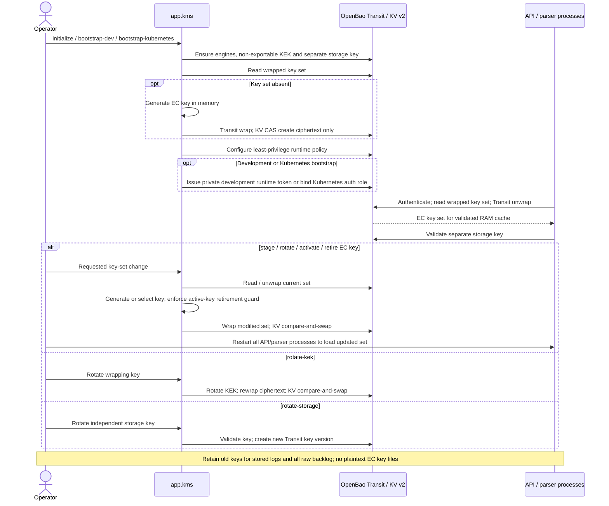
```mermaid
sequenceDiagram
    actor Operator
    participant CLI as app.kms
    participant Bao as OpenBao Transit / KV v2
    participant Runtime as API / parser processes
    Operator->>CLI: initialize / bootstrap-dev / bootstrap-kubernetes
    CLI->>Bao: Ensure engines, non-exportable KEK and separate storage key
    CLI->>Bao: Read wrapped key set
    opt Key set absent
        CLI->>CLI: Generate EC key in memory
        CLI->>Bao: Transit wrap#59; KV CAS create ciphertext only
    end
    CLI->>Bao: Configure least-privilege runtime policy
    opt Development or Kubernetes bootstrap
        CLI->>Bao: Issue private development runtime token or bind Kubernetes auth role
    end
    Runtime->>Bao: Authenticate#59; read wrapped key set#59; Transit unwrap
    Bao-->>Runtime: EC key set for validated RAM cache
    Runtime->>Bao: Validate separate storage key
    alt stage / rotate / activate / retire EC key
        Operator->>CLI: Requested key-set change
        CLI->>Bao: Read / unwrap current set
        CLI->>CLI: Generate or select key#59; enforce active-key retirement guard
        CLI->>Bao: Wrap modified set#59; KV compare-and-swap
        Operator->>Runtime: Restart all API/parser processes to load updated set
    else rotate-kek
        Operator->>CLI: Rotate wrapping key
        CLI->>Bao: Rotate KEK#59; rewrap ciphertext#59; KV compare-and-swap
    else rotate-storage
        Operator->>CLI: Rotate independent storage key
        CLI->>Bao: Validate key#59; create new Transit key version
    end
    Note over Operator,Runtime: Retain old keys for stored logs and all raw backlog#59; no plaintext EC key files
```

`prepare-dev` only creates/preserves the private development root-credential file;
it is not a remote key operation. Bootstrap preserves existing application keys.
Storage-key auto-rotation and manual rotation retain old decryption versions;
the application does not enforce a global encryption invocation counter.

### Cloud secret and key bootstrap

Sources: [GCP bootstrap/runtime code](../infra/gcp/),
[secret initialization](../infra/gcp/README.md#3-populate-secret-manager).
The cloud-only adapter replaces OpenBao; it does not migrate local ciphertext.

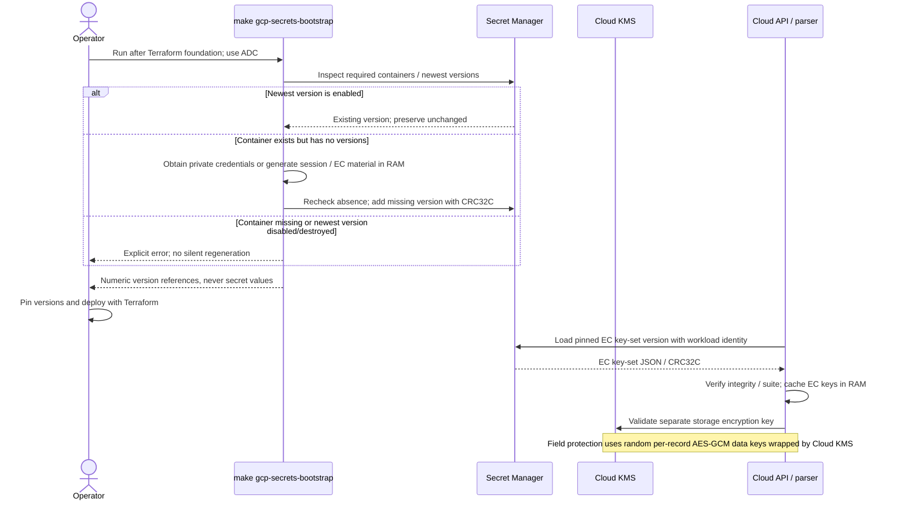
```mermaid
sequenceDiagram
    actor Operator
    participant Bootstrap as make gcp-secrets-bootstrap
    participant Secrets as Secret Manager
    participant KMS as Cloud KMS
    participant Runtime as Cloud API / parser
    Operator->>Bootstrap: Run after Terraform foundation#59; use ADC
    Bootstrap->>Secrets: Inspect required containers / newest versions
    alt Newest version is enabled
        Secrets-->>Bootstrap: Existing version#59; preserve unchanged
    else Container exists but has no versions
        Bootstrap->>Bootstrap: Obtain private credentials or generate session / EC material in RAM
        Bootstrap->>Secrets: Recheck absence#59; add missing version with CRC32C
    else Container missing or newest version disabled/destroyed
        Bootstrap-->>Operator: Explicit error#59; no silent regeneration
    end
    Bootstrap-->>Operator: Numeric version references, never secret values
    Operator->>Operator: Pin versions and deploy with Terraform
    Runtime->>Secrets: Load pinned EC key-set version with workload identity
    Secrets-->>Runtime: EC key-set JSON / CRC32C
    Runtime->>Runtime: Verify integrity / suite#59; cache EC keys in RAM
    Runtime->>KMS: Validate separate storage encryption key
    Note over KMS,Runtime: Field protection uses random per-record AES-GCM data keys wrapped by Cloud KMS
```

Frontend Auth0/session secrets and backend Mongo credentials are supplied through
their own pinned Secret Manager references. The loader receives Mongo credentials,
not EC/KMS access. Missing-only bootstrap is not a secret/key rotation workflow.
Unlike OpenBao's application-wrapped KV record, cloud EC key-set JSON is protected
by Secret Manager's at-rest encryption/access controls; the adapter uses Cloud KMS
to wrap **field-encryption data keys**, not to unwrap the EC key set.

### Automated GCP deployment

Source: [`infra/gcp/deploy.py`](../infra/gcp/deploy.py);
[setup and safety boundaries](../infra/gcp/README.md#automated-deployment).
This is an operator-side control-plane flow, not an additional runtime service.

```mermaid
sequenceDiagram
    actor Operator
    participant Script as make gcp-check / gcp-deploy
    participant Local as Local env files / tfvars
    participant CLI as gcloud / Docker
    participant TF as Terraform
    participant GCP as GCP resources / Cloud Run
    participant Secrets as Secret Manager
    Operator->>Script: Check or deploy#59; optional project/region/release overrides
    Script->>Local: Read whitelisted env settings#59; never source shell code
    Script->>TF: Evaluate HCL in providerless temporary directory
    Script->>CLI: Check login, billing and Cloud Run state#59; verify ADC
    CLI->>GCP: Read cloud metadata
    alt Read-only check
        Script-->>Operator: Service state / explicit prerequisite failures#59; no cloud mutation
    else Deploy with approval
        Script->>CLI: Ensure private versioned state bucket
        Script->>TF: Initialize matching backend#59; inspect state ownership
        Script->>TF: Plan foundation, preserving existing managed services
        TF-->>Script: Plan#59; refuse all deletion/replacement
        Script->>TF: Apply approved plan
        Script-->>Operator: NAT IP and generated Auth0 URLs
        Operator->>Operator: Configure Atlas allowlist and Auth0 URLs, preserving existing entries
        Operator->>Script: Confirm external setup or use external-ready flag
        Script->>Secrets: Missing-only bootstrap#59; reuse suitable local inputs / prompt securely
        Secrets-->>Script: Enabled numeric secret pins#59; no rotation
        Script->>CLI: Build/push missing immutable backend/frontend release tags
        CLI->>GCP: Publish images to Artifact Registry
        Script->>Local: Persist nonsecret settings, image tags and secret pins
        Script->>TF: Plan/apply nondestructive four-service rollout
        TF->>GCP: Create/update services and infrastructure
        Script->>GCP: Verify four Ready conditions and public HTTP 200/401 boundaries
        Script-->>Operator: Frontend/API URLs or explicit failed step
    end
```

Reruns preserve existing secret values and pins; existing immutable images are
reused when the same release is requested. Local Mongo/emulators/OpenBao are not
cloud dependencies. Atlas provisioning and Auth0 tenant administration remain
external prerequisites; successful probes are not authenticated end-to-end
ingestion or live deployment performance evidence.

### Ingestion latency measurement

Source: [`benchmark_ingestion.py`](../integration_tests/benchmark_ingestion.py);
[benchmark procedure](RUNBOOK.md#measuring-ingestion-latency).
This measures the existing ingestion flow; runtime architecture is unchanged.

```mermaid
sequenceDiagram
    actor Operator
    participant Benchmark
    participant API
    participant Pipeline as Parser / loader / Mongo
    Operator->>Benchmark: Synthetic gzip/JWE, dedicated token, bounded concurrency
    Benchmark->>Benchmark: Validate origin and positive finite timeout
    loop Concurrent uploads with separately bounded upload and polling slots
        Benchmark->>API: POST /traffic-log-uploads
        API-->>Benchmark: Durable raw acknowledgement
        Benchmark->>Benchmark: Record acknowledgement latency
        API-->>Pipeline: Object event#59; asynchronous processing
        loop Poll each acknowledged upload while other uploads continue
            Benchmark->>API: GET upload receipt
            API-->>Benchmark: Current state
            Benchmark->>Benchmark: Release request slot before polling delay
        end
        Benchmark->>Benchmark: Record observed stored latency or fail explicitly
    end
    Benchmark-->>Operator: ACK/storage percentiles#59; rate through final acknowledgement
```

Observed storage includes status polling delay, not an exact Mongo completion
timestamp. Failure states abort the run; they are not reported as successful
samples. Percentiles from small local runs do not establish production capacity.

### Local development startup and maintenance

Sources: [`Makefile`](../Makefile), [`docker-compose.yml`](../docker/docker-compose.yml);
[local mode guide](RUNBOOK.md#run-the-live-development-stack) and
[GCP impact analysis](../infra/gcp/README.md#impact-of-local-compose-profiles-and-native-collector-mode).

```mermaid
sequenceDiagram
    participant Operator
    participant Make
    participant Compose
    participant Bao as OpenBao
    participant Init as Queue / bucket initialization
    participant Apps as Collector / parser / loader / frontend
    Operator->>Make: local-containers-up
    Make->>Make: Prepare ignored credential files
    Make->>Compose: Start OpenBao without recreating a running instance
    Make->>Bao: Idempotent key bootstrap / runtime credential
    Make->>Compose: Start infra and await health
    Make->>Init: Provision topics/subscriptions and raw notification bucket
    Init-->>Make: Completed or explicit error
    alt Full container mode
        Make->>Compose: Stop native proxy variants#59; select full application services
        Compose->>Apps: Recreate only application containers#59; refresh credential mounts
        Note over Compose,Apps: Dedicated container proxy uses Docker DNS#59; no host gateway
    else Native collector mode
        Operator->>Make: local-collector-run after infra setup
        Make->>Apps: Foreground host Python collector only
        Note over Operator,Apps: Start native frontend and native/container workers separately
    end
    opt Explicit cleanup retry
        Operator->>Make: local-cleanup UPLOAD_ID=stored receipt ID
        Make->>Compose: Run one-shot cleaner#59; never enable with full
        Compose->>Apps: Existing receipt-based cleanup#59; reject non-stored receipt
    end
    Note over Make,Bao: local-apps-stop preserves running dependencies/keys#59; full down loses ephemeral keys
```

These operations do not invoke Terraform or alter Cloud Run services. Old Make
names remain compatibility aliases. Profile validation, development-only routing
tests and real local ingestion verify the execution boundary.

## Validation scope

The [test runbook](RUNBOOK.md#run-tests) separates fast tests from opt-in services:
real Mongo indexes/replica routing/CAS, isolated OpenBao key operations, MinIO
notifications through emulator/Mongo, proxy forwarding and two-device live OAuth.
GCS conditional operations use mocked SDK calls; Terraform tests use mocked
providers. Frontend mocks verify SSR/forms without JavaScript; a separate fixture
exercises real FastAPI/Mongo but replaces Auth0/KMS. Only live-tenant tests validate
actual OAuth grants. See [frontend validation](../frontend/README.md#validation).
The [local performance report](../performance-report.md) records a measured
ingestion matrix and regression results, separately from production capacity.

## Known limitations

- At-least-once delivery can duplicate ambiguously acknowledged time-series
  inserts. Acknowledgement means raw receipt; stored status does not eliminate
  secondary visibility lag.
- Raw can contain subsequently discarded values. Failed/pending raw and retry
  receipts have no age TTL; define an approved abandonment procedure.
- Status probes/heartbeats are snapshots, not end-to-end guarantees or queue/DLQ
  depth. Keep native backlog and error alerts.
- Overview metrics are samples, not aggregation. Classification, raw/DLQ
  management screens, multi-tenancy, attestation and real-time SSE are absent.
- Registration does not provision Auth0 credentials; external agents must
  implement configuration polling and encryption themselves.
- Ephemeral local OpenBao loses keys on restart. Cloud/local ciphertext are not
  interchangeable; backup recovery depends on retaining the correct keys.
- No production p50/speedup claim or live GCP deployment validation is recorded.

The [verification plan](PLAN.md) owns remaining deployment gates; do not copy
contracts or derive tasks from the README's protected manual roadmap here.
